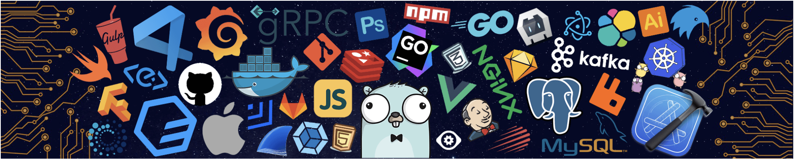

<!-- START Visitor Count -->

<h2 align="centre">Visitors Count</h2>  

 
 

  

- 🔭 I’m currently working on [Mission Marketplace](https://mission.dev/)

- 🌱 I’m currently learning **Nextjs, Nestjs**

- 👯 I’m looking to collaborate on **Ruby on Rails, React**

- 💬 Ask me about **Javascript, Ruby on Rails, React and Nodejs**

- 📫 How to reach me **work.ertiza@gmail.com**

- ⚡ Fun fact **I think I'm easy going**

<h3 align="left">Connect with me:</h3>

<h3 align="left">Languages and Tools:</h3>
<table align="center">
  <tr>
    <td align="center" width="96">
      
       Angular
    </td>
    <td align="center" width="96">
      
       Angular JS
    </td>
    <td align="center" width="96">
      
       AWS
    </td>
    <td align="center" width="96">
      
       Babel JS
    </td>
    <td align="center" width="96">
      
       Bootstrap
    </td>
    <td align="center" width="96">
      
       Coffeescript
    </td>
    <td align="center" width="96">
      
       D3 JS
    </td>
    <td align="center" width="96">
      
       Docker
    </td>
    <td align="center" width="96">
      
       Dart
    </td>
  </tr>
  <tr>
    <td align="center" width="96">
      
       Express JS
    </td>
    <td align="center" width="96">
      
       Figma
    </td>
    <td align="center"  width="96">
      
       Firebase
    </td>
    <td align="center"  width="96">
      
       Flutter
    </td>
    <td align="center" width="96">
      
       Git
    </td>
    <td align="center"  width="96">
      
       GraphQL
    </td>
    <td align="center" width="96">
      
       Heroku
    </td>
    <td align="center" width="96">
      
       Ionic
    </td>
    <td align="center" width="96">
      
       Javascript
    </td>
  </tr>
  <tr>
    <td align="center" width="96">
      
       Kafka
    </td>
    <td align="center" width="96">
      
       Laravel
    </td>
    <td>
      
       Linux
    </td>
     <td align="center" width="96">
      
       Materialize CSS
    </td>
    <td align="center" width="96">
      
       MongoDB
    </td>
    <td align="center" width="96">
      
       MySQL
    </td>
    <td align="center" width="96">
      
       Nginx
    </td>
    <td align="center" width="96">
      
       NodeJs
    </td>
    <td align="center" width="96">
      
       PHP
    </td>
  </tr>
  <tr>
    <td align="center" width="96">
      
       PostgreSQL
    </td>
     <td align="center" width="96">
      
       Postman
    </td>
    <td align="center" width="96">
      
       RabbitMQ
    </td>
     <td align="center"  width="96">
      
       Ruby on Rails
    </td>
    <td align="center" width="96">
      
       ReactJS
    </td>
    <td align="center" width="96">
      
       Redis
    </td>
    <td align="center" width="96">
      
       Redux
    </td>
    <td align="center" width="96">
      
       Rest
    </td>
    <td align="center"  width="96">
      
       SASS
    </td>
  </tr>
  <tr>
    <td align="center" width="96">
      
       Tailwind CSS
    </td>
    <td align="center" width="96">
      
       Typescript
    </td>
    <td align="center" width="96">
      
       VueJS
    </td>
    <td align="center" width="96">
      
       Vuetify
    </td>
    <td align="center" width="96">
      
       Webpack
    </td>
  </tr>
</table>

## GitHub Stats:

<table align="center" style="border: none;">
  <tr style="border: none;">
    <td style="border: none;">
      
    </td>
    <td style="border: none;">
      
    </td>
  </tr>
</table>

<footer>
	
</footer>
